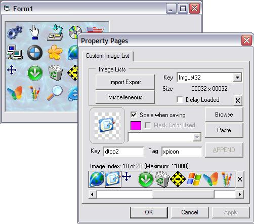



## LaVolpe ImageList II \(8Jan08\)

### Description

Updated, faster renderings. Based on of my c32bppDIB suite, supports pngs, xp/vista icons, and other common graphics. One control that supports multiple imagelists (same/different sizes). THIS IS NOT TRULY DESIGNED to be added uncompiled to a project, rather it is designed to be a stand-alone OCX. The property page is optional if you just need a runtime-only imagelist. 15Nov07:: Added optional image compression if GDI+/zLib not on O/S, added optional image key/tag compression, added multi-select browse, multi-file drag&amp;drop, multi-file Copy&amp;Paste abilities, added image re-ordering via dragging, added importing from VB imagelists, and fixed some minor bugs. 23Nov07: Masks were not kept with multi-selected files, added several more properties/methods, more examples. 3Dec07: Overhauled class structure, fixed minor errors with property page, added more to the RTF file. Barring bugs, moving on to something new. 8Jan08: Significantly faster rendering from the imagelist. GDI+ would process entire DIB at times to render one image. When imagelist is massive size, slow down noticable. Using a rendering-only DIB can improve drawing multiple images over 30x faster for large lists.

Open with Group1.vbg. See Usage_ImageList.RTF file for overview.
 
### More Info
 

             |
---                |---
**Submitted On**   |2008-01-07 22:31:18
**By**             |[LaVolpe](https://github.com/Planet-Source-Code/PSCIndex/blob/master/ByAuthor/lavolpe.md)
**Level**          |Advanced
**User Rating**    |5.0 (135 globes from 27 users)
**Compatibility**  |VB 6\.0
**Category**       |[Custom Controls/ Forms/  Menus](https://github.com/Planet-Source-Code/PSCIndex/blob/master/ByCategory/custom-controls-forms-menus__1-4.md)
**World**          |[Visual Basic](https://github.com/Planet-Source-Code/PSCIndex/blob/master/ByWorld/visual-basic.md)
**Archive File**   |[LaVolpe\_Im209651182008\.zip](https://github.com/Planet-Source-Code/lavolpe-lavolpe-imagelist-ii-8jan08__1-69621/archive/master.zip)

